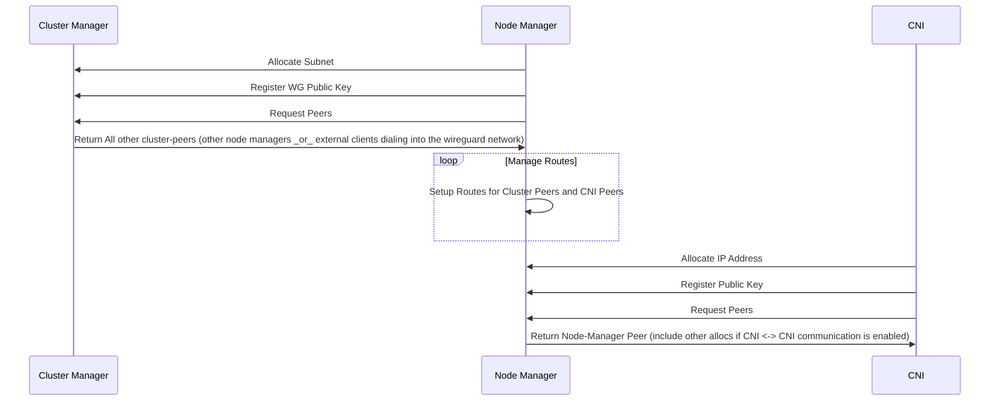
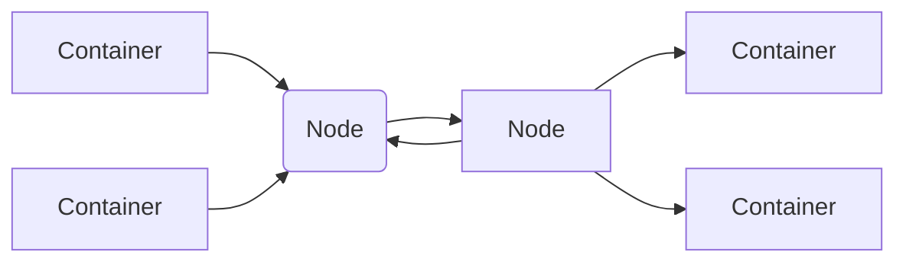

# Wireguard CNI

Wireguard CNI is a plugin implementation of the Container Networking Interface. It is composed of 3 components - a Cluster Manager, Node Manager, and the Containers themselves.  It will create a secure wireguard mesh between components and manage IP management between all nodes in a _cluster_. A cluster is any set of nodes that share a cluster-manager.

# Getting Started
We use protobuf to generate our APIs and types. All code is checked in so building the project can be done without any code generation dependencies installed. A list of available make targets can be found using
```
make help
```

## Quick Start

Install dependencies
```
# install wireguard-tools package for your OS
## install dependencies
make deps && make extra-deps && ./.bin/nomad &
## Run jobs in nomad
nomad run nomad/cluster-manager.hcl
nomad run nomad/node-manager.hcl
nomad run nomad/sleep.hcl
## see that wireguard is running
sudo wg
## kill and cleanup nomad
kill %1
## I've seen the node-manager leave the wg0 interface behind. Still need to dig into that
sudo ip link del wg0
```

## Building

Building the initial software requires no dependencies other than Go itself.
```
make build
```

There's also a make target to build inside a docker container using
```
make docker/build
```

## Code Generation
buf, protoc-gen-go and protoc-gen-connect-go are both required to generate the APIs and types. All of them are easily installed using
```
make deps
```

And code can be generated using
```
make proto
```

## Running the project
There are vagrant and nomad configuration available. Both binaries are installable using `make extra-deps`

## Components

### Cluster Manager
The cluster manager handles IP Management for a set of nodes. It hands out subnets to nodes to manage. It also performs Wireguard Public Key coordination and shares the list of peers and subnets between nodes. This enables encrypted node <-> node communication over the wireguard mesh.

### Node Manager
Each "node" gets it's own IP space to manage from the cluster manager and hand out to network namespaces or wireguard peers. The node-manager performs the same responsibility as the Cluster Manager but at a per-namespace level. It also creates peers and routing between itself and the network namespaces running on the node and between other nodes.

#### Dependencies
* Cluster Manager
* wireguard-tools
* iptables

### CNI
The cni creates the wireguard interface and sets the default route from the container to go through the wireguard interface

#### Dependencies
* Node Manager
* wireguard-tools
* iptables

### Component Sequence Diagram


## Network Communication Model

The network communication model is a hub and spoke. Containers connect to nodes. Nodes connect to other nodes. Traffic routes from a container to a node to another node to a container.

### Diagram


# Initial Proof of Concept

Initial proof of concepts exist as static configuration and bash scripts in the bash-poc folder. These exist to prove out the initial networking model and configuration. Read README's there for more instructions. All POC's should be started
by running `vagrant up`
