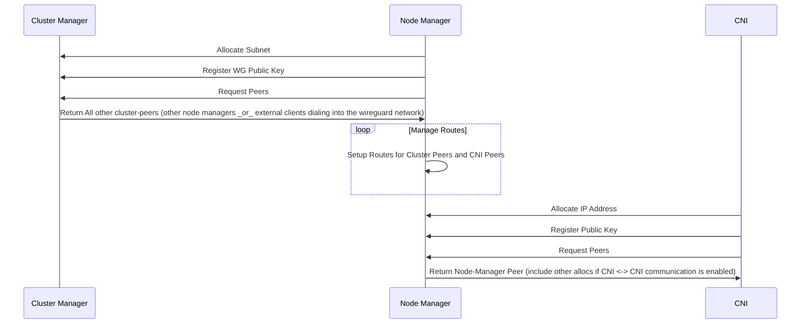

# Wireguard CNI

## Sequence Diagram

# Proof of Concept

Initial proof of concepts exist in the bash-poc. Read README's there for more instructions. All POC's should be started
by running `vagrant up`

# Simple CNI plugin

This is an example of a sample chained plugin. It includes solutions for some
of the more subtle cases that can be experienced with multi-version chained
plugins.

To use it, just add your code to the cmdAdd and cmdDel plugins.
