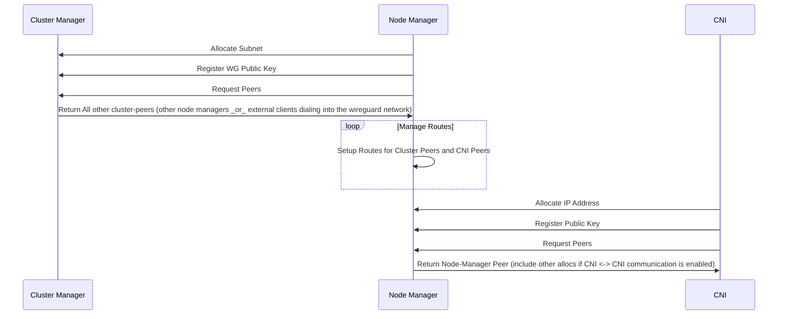

# Wireguard CNI

Wireguard CNI is a 3 component container networking interface. It will create a wireguard mesh between components and manage IP management between all nodes in a "cluster". A cluster is any set of components or machines that share a cluster-manager.

## Components

### Cluster Manager
The cluster manager handles IP Management for a set of nodes. It hands out subnets to nodes to manage. It also performs Wireguard Public Key coordination and shares the list of peers and subnets between nodes. This enables node <-> node communication over the wireguard mesh

### Node Manager
Each "node" gets it's own IP space to manage from the cluster manager and hand out to network namespaces or wireguard peers. The node-manager performs the same responsibility as the Cluster Manager but at a per-namespace level. It also creates peers and routing between itself and the network namespaces running on the node and between other nodes.

### CNI
The cni creates the wireguard interface and sets the default route from the container to go through the wireguard interface

### Component Sequence Diagram


## Network Communication Model
```mermaid
```

# Proof of Concept

Initial proof of concepts exist in the bash-poc. Read README's there for more instructions. All POC's should be started
by running `vagrant up`

# Simple CNI plugin

This is an example of a sample chained plugin. It includes solutions for some
of the more subtle cases that can be experienced with multi-version chained
plugins.

To use it, just add your code to the cmdAdd and cmdDel plugins.
